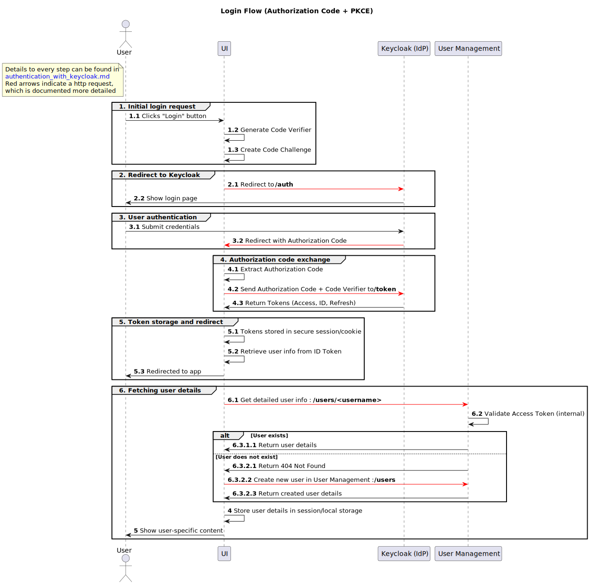

# Authentication with Keycloak

This document outlines our planned approach for implementing authentication in our application using Keycloak as the identity provider. 

## Additional Information
- [Keycloak Documentation](https://www.keycloak.org/documentation)
- [Keycloak Authentication Flows](./keycloak_authentication_flows.md)
- [Keycloak Token Types](./keycloak_token_types.md)

## Keycloak Setup
Prerequisites are a running instance of Keycloak. You can use the official Keycloak Docker image for local development.
F
## Planned Keycloak Configuration

- A new realm will be created in Keycloak specifically for this application, called `gromokoso`
- Within this realm, the following clients will be defined (all use `OpenID Connect` as client type):
    - User Interface Client
        - Client ID: `gromokoso-ui`
        - Access Type: `public` (client authentication: `off`)
        - Authentication Flow: [Standard Flow](./keycloak_authentication_flows.md#standard-flow-authorization-code-flow) with PKCE
        - Valid Redirect URIs: `gromokoso:8080`
    <!-- - API Management
        - Client ID: `api-management`
        - Access Type: `confidential` (client authentication: `on`)
        - Valid Redirect URIs: `http://localhost:8000/*`    
    - User Management
        - Client ID: `user-management`
        - Access Type: `confidential` (client authentication: `on`)
        - Valid Redirect URIs: `http://localhost:8001/*` -->
    - MCP Management
        - Client ID: `mcp-management`
        - Access Type: `confidential` (client authentication: `on`)
        - Authentication Flow: [Service Account Roles](./keycloak_authentication_flows.md#service-account-roles-client-credentials-flow)
        - Valid Redirect URIs: `*`
    

- User roles will be established and assigned to users based on their responsibilities within the application.

## Login Flow




### 1. Initial login request
The user initiates the login process by clicking the "Login" button in the UI. This triggers the generation of a `code_verifier` and its corresponding `code_challenge` for PKCE.


---
### 2. Redirect to Keycloak

#### 2.1 Redirect to Keycloak login page
The UI redirects the user to Keycloak login page using the [Authorization Code Flow](keycloak_authentication_flows.md#standard-flow-authorization-code-flow) with PKCE.

**Example URL:**

```https://<keycloak-domain>/realms/gromokoso/protocol/openid-connect/auth?client_id=gromokoso-ui&redirect_uri=http://localhost:3000/callback&response_type=code&scope=openid&code_challenge=SplxlOBeZQQYbYS6WxSbIA&code_challenge_method=S256```


| Parameter             | Description                                                               | Possible value                 |
| --------------------- | ------------------------------------------------------------------------- | ------------------------------ |
| client_id             | The ID of the Keycloak client configured for the UI                       | gromokoso-ui                   |
| redirect_uri          | The URI to redirect to after authentication                               | http://localhost:3000/callback |
| response_type         | The type of response expected (authorization code flow)                   | code                           |
| scope                 | The scope of access requested (OpenID Connect)                            | openid                         |
| code_challenge        | PKCE challenge, a hashed value of the code verifier for enhanced security | SplxlOBeZQQYbYS6WxSbIA          |
| code_challenge_method | The method used to hash the code verifier (S256 = SHA-256)                | S256                           |

---
### 3. User authenticates with Keycloak
User enters their credentials on the Keycloak login page. Upon successful authentication, Keycloak redirects the user back to the specified `redirect_uri` with an authorization code.

**Redirect URL example:**

```http://localhost:3000/callback?code=SplxlOBeZQQYbYS6WxSbIA&state=af0ifjsldkj```

| Parameter | Description                                                        | Example value          |
| --------- | ------------------------------------------------------------------ | ---------------------- |
| code      | The authorization code to be exchanged for tokens                  | SplxlOBeZQQYbYS6WxSbIA |
| state     | The state parameter to maintain state between request and callback | af0ifjsldkj            |


---
### 4. Authorization code exchange
The frontend application handles the redirect at the designated callback (``/callback``) endpoint.:

#### 4.1 Extract the authorization code
Extract the authorization code from the URL

#### 4.2 Send Authorization Code to Keycloak
Exchange the authorization code and code_verifier for tokens (Access Token, ID Token, Refresh Token) by making a POST request to Keycloak on the endpoint `/token`.

#### 4.3 Return tokens
Keycloak validates the authorization code and code_verifier. If valid, Keycloak responds with the tokens, which the frontend application receives.


---
### 5. Token storage and redirect

#### 5.1 The frontend stores the tokens .
The frontend securely stores the tokens in a secure, HTTP-only cookie or in memory (not in local storage) to prevent XSS attacks.

#### 5.2 The user is redirected to the main application interface, now logged in.


